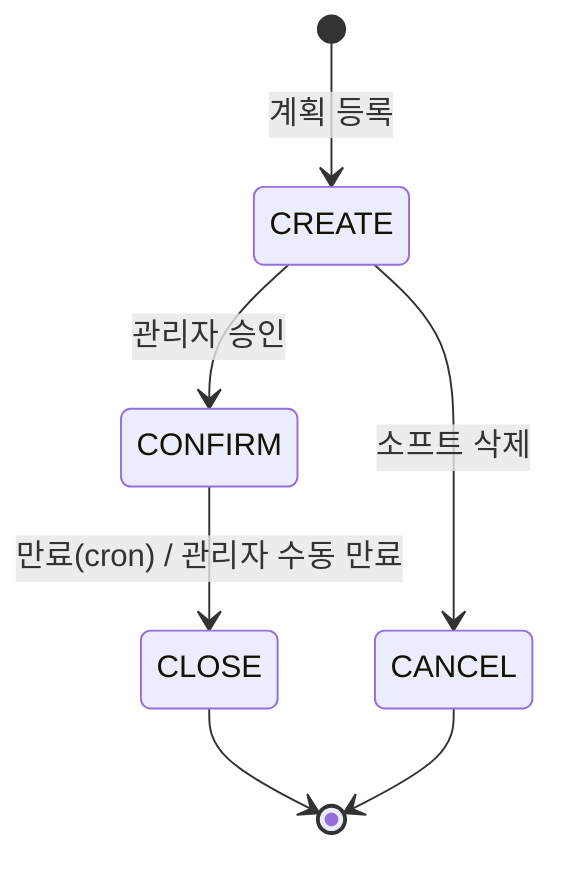
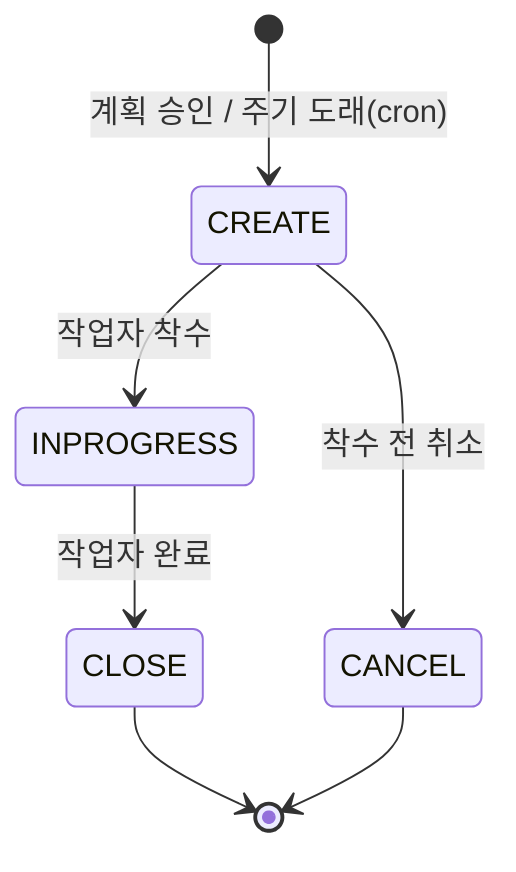
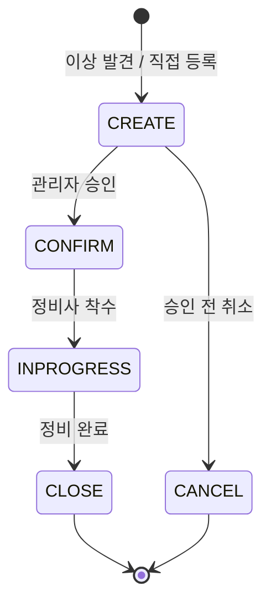
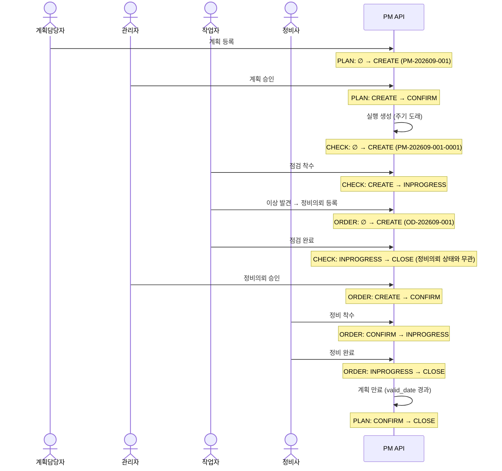

# 도메인 모델

설비 점검(PM) 상태머신 API의 핵심 도메인 정의. 엔티티 구조, 상태값, 상태 전이 규칙, 정합성 규칙, 채번 규칙을 다룬다.
이 문서의 상태 전이 매트릭스와 정합성 규칙이 단위테스트(상태 전이 20~30개)의 근거가 된다.

---

## 1. 용어 정의

| 용어 | 뜻 |
|------|-----|
| PM (Preventive Maintenance) | 설비 예방 점검. 본 문서에서 "점검"과 동의어 |
| 설비 (EQUIP) | 점검 대상이 되는 장비. 마스터 데이터(seed로만 제공) |
| 계획 (PLAN) | 특정 설비에 대한 주기적 점검 계획 |
| 실행 (CHECK) | 계획으로부터 주기마다 생성되는 개별 점검 실행 건 |
| 정비 / 정비의뢰 (ORDER) | 점검 중 발견된 이상에 대한 후속 정비 작업 요청 |
| 채번 | 엔티티 생성 시 규칙에 따라 사람이 읽을 수 있는 업무 ID를 부여하는 것 |

### 액터

| 액터 | 역할 |
|------|------|
| 계획담당자 | 점검 계획 등록 |
| 관리자 | 계획 승인, 정비의뢰 승인, 계획 수동 만료 |
| 작업자 | 점검 실행(착수·완료), 이상 발견 시 정비의뢰 등록 |
| 정비사 | 정비의뢰 처리(착수·완료) |

> MVP에서는 인증을 생략하거나 단순 API key만 사용한다. 액터는 문서상 역할 구분일 뿐 권한 제어는 스코프 밖.

---

## 2. 엔티티

```mermaid
erDiagram
    EQUIP {
        bigint   id             PK "대리키 (IDENTITY)"
        string   code              UK "설비 코드"
        string   name              "설비 이름"
        double   period            "점검 주기"
        string   unit              "점검 주기 단위 (UNIT)"
        string   description       "비고"
        datetime created_at        "생성일시"
        string   created_by        "생성자"
        datetime modified_at       "수정일시"
        string   modified_by       "수정자"
    }
    PLAN {
        bigint   id             PK "대리키 (IDENTITY)"
        string   code              UK "계획 번호 (PM-YYYYMM-nnn)"
        string   name              "계획 내용"
        bigint   equip_id       FK "설비 대리키"
        date     valid_date        "만료일"
        double   period            "점검 주기"
        string   unit              "점검 주기 단위 (UNIT)"
        datetime next_scheduled_at "다음 실행 생성 예정일시 (cron 조회 기준)"
        string   status            "상태 (STATUS)"
        string   approved_by       "승인자"
        datetime approved_at       "승인일시"
        string   description       "비고"
        datetime created_at        "생성일시"
        string   created_by        "생성자"
        datetime modified_at       "수정일시"
        string   modified_by       "수정자"
    }
    CHECK {
        bigint   id             PK "대리키 (IDENTITY)"
        string   code              UK "실행 번호 (PM-YYYYMM-nnn-mmmm)"
        string   name              "점검 내용"
        bigint   plan_id        FK "계획 대리키"
        bigint   equip_id       FK "설비 대리키 (계획에서 복사)"
        datetime scheduled_at      "점검 예정일시"
        datetime started_at        "점검 착수일시"
        datetime closed_at         "점검 완료일시"
        string   status            "상태 (STATUS)"
        string   worked_by         "작업자"
        string   description       "비고"
        datetime created_at        "생성일시"
        string   created_by        "생성자"
        datetime modified_at       "수정일시"
        string   modified_by       "수정자"
    }
    ORDER {
        bigint   id             PK "대리키 (IDENTITY)"
        string   code              UK "의뢰 번호 (OD-YYYYMM-nnn)"
        string   name              "의뢰 내용"
        bigint   check_id       FK "실행 대리키"
        datetime requested_at      "의뢰일시"
        datetime closed_at         "정비 완료일시"
        string   status            "상태 (STATUS)"
        string   worked_by         "정비사"
        string   approved_by       "승인자"
        string   description       "비고"
        datetime created_at        "생성일시"
        string   created_by        "생성자"
        datetime modified_at       "수정일시"
        string   modified_by       "수정자"
    }

    EQUIP ||--o{ PLAN  : "1:N (설비별 다수 계획)"
    PLAN  ||--o{ CHECK : "1:N (계획별 다수 실행)"
    CHECK ||--o{ ORDER : "1:N (실행별 다수 정비의뢰)"
```



### 설계 노트

- **PK = 대리키(`bigint` IDENTITY), 업무번호 = `code`(UNIQUE)** — [architecture.md](architecture.md) 결정 A.
  업무번호를 PK로 쓰면 FK 전파가 장황하고 채번 실패 시 행 자체가 안 생겨 재시도가 어렵다.
  FK도 대리키(`plan_id bigint`)를 참조한다. `code`의 `UNIQUE` 제약이 채번 중복의 최종 안전망([ADR-0003](adr/0003-numbering-strategy.md)).
- **`o{` (0..N)**: 계획은 승인 전이면 실행이 0건, 실행은 이상이 없으면 정비의뢰가 0건. 모두 선택적 관계다.
- **`equip_id`를 CHECK에 중복 보유**: 계획 시점의 설비를 실행 건에 고정(스냅샷)하기 위함. 계획의 설비가 바뀌어도 과거 실행 건의 추적성이 유지된다.
- **`PLAN.next_scheduled_at`**: cron이 `next_scheduled_at <= now`인 `CONFIRM` 계획을 조회해 CHECK를 생성하고, 생성 후 `period·unit` 만큼 전진시킨다. 실행 예정일 계산을 매번 하지 않고 조회를 단순화한다 ([architecture.md](architecture.md) 결정 E).
- **감사 컬럼**: 4개 엔티티 모두 `created_at/by`, `modified_at/by` 공통 보유. 공통 상위 클래스(`BaseEntity`)로 추출 권장.

> **결정 (2026-09-06)** — 공통코드(`COMMON_CLASSIFICATION` / `COMMON_CODE`) 테이블은 두지 않는다.
> `STATUS`/`UNIT`은 도메인이 통제하는 코드이지 업무 사용자가 편집하는 마스터 데이터가 아니다.
> enum 직접 사용 시 조인·캐시·관리 CRUD가 불필요하다.
> 코드값 런타임 관리 요구가 생기면 별도 결정으로 재도입한다.

---

## 3. 상태값 (ENUM)

```java
// 모든 상태 엔티티가 공유하는 상태 집합. 엔티티별 유효 부분집합은 아래 표 참조.
enum Status {
    CREATE,      // 생성됨 (초안 / 승인 대기)
    CONFIRM,     // 승인됨
    INPROGRESS,  // 진행 중
    CLOSE,       // 종료 (정상 완료 / 만료)
    CANCEL       // 취소 (비활성화)
}

enum Unit {
    DAY, WEEK, MONTH, YEAR
}
```

### 엔티티별 유효 상태

| 엔티티 | CREATE | CONFIRM | INPROGRESS | CLOSE | CANCEL |
|--------|:---:|:---:|:---:|:---:|:---:|
| PLAN  | O | O | – | O | O |
| CHECK | O | – | O | O | O |
| ORDER | O | O | O | O | O |

- PLAN은 `INPROGRESS`가 없다 — 승인되면 곧바로 실행 생성 단계로 넘어간다.
- CHECK는 `CONFIRM`이 없다 — 상위 계획 승인으로 이미 확정된 상태로 생성된다.

### CLOSE / CANCEL 의미 구분

| 상태 | 의미 | 도달 방법 |
|------|------|-----------|
| CLOSE | 정상 종료 (목적 달성) | 점검·정비 완료, 계획 만료 |
| CANCEL | 비정상 종료 (중단) | 소프트 삭제 / 착수 전 취소 |

두 상태 모두 **터미널**이며 이후 어떤 전이도 불가하다.

---

## 4. 상태 전이

> 구현 방식은 [ADR-0002](adr/0002-state-machine-implementation.md) 참조 — 이 장의 전이 매트릭스가 enum 전이 테이블로 1:1 대응된다.

### 4.1 점검계획 PLAN



**전이 매트릭스** (행 = From, 열 = To)

| From \ To | CREATE | CONFIRM | CLOSE | CANCEL |
|-----------|:---:|:---:|:---:|:---:|
| CREATE    | –  | O  | –  | O  |
| CONFIRM   | –  | –  | O  | –  |
| CLOSE     | –  | –  | –  | –  |
| CANCEL    | –  | –  | –  | –  |

**허용 전이 상세**

| # | From → To | 트리거 | 선행조건 | 부수효과 |
|---|-----------|--------|----------|----------|
| P1 | ∅ → CREATE | 계획담당자 등록 | 설비 존재, `period > 0` | 채번 `PM-YYYYMM-nnn` |
| P2 | CREATE → CONFIRM | 관리자 승인 | – | `approved_by/at` 기록, CHECK 생성 개시 |
| P3 | CREATE → CANCEL | 승인 전 소프트 삭제 | – | – |
| P4 | CONFIRM → CLOSE | `valid_date` 경과(cron) 또는 관리자 수동 만료 | – | 이후 CHECK 생성 중단 |

**금지 전이 (대표)**

| From → To | 사유 |
|-----------|------|
| CONFIRM → CANCEL | 승인된 계획은 취소 불가. 중단하려면 수동 만료(CLOSE) 사용 |
| CONFIRM → CREATE | 승인 되돌리기 불가 |
| CREATE → CLOSE | 미승인 계획에는 만료 개념 없음 |
| CLOSE / CANCEL → * | 터미널 |

---

### 4.2 점검실행 CHECK



**전이 매트릭스**

| From \ To | CREATE | INPROGRESS | CLOSE | CANCEL |
|-----------|:---:|:---:|:---:|:---:|
| CREATE     | –  | O  | –  | O  |
| INPROGRESS | –  | –  | O  | –  |
| CLOSE      | –  | –  | –  | –  |
| CANCEL     | –  | –  | –  | –  |

**허용 전이 상세**

| # | From → To | 트리거 | 선행조건 | 부수효과 |
|---|-----------|--------|----------|----------|
| C1 | ∅ → CREATE | 계획 승인 시 / cron 주기 도래 | 상위 PLAN `status = CONFIRM` | 채번 `PM-YYYYMM-nnn-mmmm`, 설비 스냅샷 |
| C2 | CREATE → INPROGRESS | 작업자 착수 | – | `started_by/at` 기록 |
| C3 | CREATE → CANCEL | 착수 전 취소 | – | – |
| C4 | INPROGRESS → CLOSE | 작업자 완료 | **없음** (파생 정비의뢰 상태와 무관) | `closed_at` 기록 |

**금지 전이 (대표)**

| From → To | 사유 |
|-----------|------|
| INPROGRESS → CANCEL | 착수한 점검은 취소 불가. 완료(CLOSE)만 가능 |
| CLOSE → INPROGRESS / * | 터미널. 완료된 점검 재개·수정 불가 (**R01**) |
| INPROGRESS → CREATE | 되돌리기 불가 |
| ∅ → CREATE (PLAN ≠ CONFIRM) | 미승인 계획은 실행을 가질 수 없음 |

> **분리 원칙**: 점검 완료는 "점검 행위가 끝났다"는 의미이며, 파생된 정비의뢰의 진행 여부와 독립적이다. (**R03** 참조)

---

### 4.3 정비의뢰 ORDER



**전이 매트릭스**

| From \ To | CREATE | CONFIRM | INPROGRESS | CLOSE | CANCEL |
|-----------|:---:|:---:|:---:|:---:|:---:|
| CREATE     | –  | O  | –  | –  | O  |
| CONFIRM    | –  | –  | O  | –  | –  |
| INPROGRESS | –  | –  | –  | O  | –  |
| CLOSE      | –  | –  | –  | –  | –  |
| CANCEL     | –  | –  | –  | –  | –  |

**허용 전이 상세**

| # | From → To | 트리거 | 선행조건 | 부수효과 |
|---|-----------|--------|----------|----------|
| O1 | ∅ → CREATE | 점검 중 이상 발견 / 직접 등록 | 상위 CHECK `status ∈ {INPROGRESS, CLOSE}` | 채번 `OD-YYYYMM-nnn` |
| O2 | CREATE → CONFIRM | 관리자 승인 | – | `approved_by` 기록 |
| O3 | CREATE → CANCEL | 승인 전 취소 | – | – |
| O4 | CONFIRM → INPROGRESS | 정비사 착수 | – | – |
| O5 | INPROGRESS → CLOSE | 정비 완료 | – | `closed_at` 기록 |

**금지 전이 (대표)**

| From → To | 사유 |
|-----------|------|
| CONFIRM → CANCEL | 승인된 정비의뢰는 취소 불가 |
| INPROGRESS → CANCEL | 착수한 정비는 취소 불가. 완료(CLOSE)만 가능 |
| CONFIRM → CREATE | 승인 되돌리기 불가 |
| CREATE → INPROGRESS | 승인 단계 생략 불가 |
| CLOSE / CANCEL → * | 터미널 |

---

## 5. 정합성 규칙

> 도메인 계층 규칙이다. HTTP 상태 코드·에러 응답 바디 매핑은 `api-conventions.md`에서 별도로 정의한다.

| No | 규칙 | 트리거 (도메인 연산) | 선행조건 | 결과 | 도메인 예외 |
|----|------|----------------------|----------|------|-------------|
| R01 | 종료·취소된 계획/실행은 수정 불가 | PLAN·CHECK 필드 수정 | `status ∈ {CLOSE, CANCEL}` | 거부 | `NotModifiableException` |
| R02 | 하위 데이터가 있으면 삭제 불가 | PLAN 삭제 / CHECK 삭제 (hard delete, soft delete 모두) | 자식 1건 이상 존재 | 거부 | `HasChildrenException` |
| R03 | 점검실행과 정비의뢰는 라이프사이클이 분리된다 | ORDER 상태 전이 | 상위 CHECK 상태 무관 (CLOSE여도 허용) | 허용 | – (분리 불변식 검증용) |

### 규칙별 상세

- **R01**
  - 대상 필드: 상태 전이를 제외한 모든 업무 필드(`name`, `description`, `valid_date` 등).
  - `CANCEL` 상태도 수정 불가 대상에 포함한다.
  - 상태 전이 자체는 4장 매트릭스가 별도로 통제한다.
- **R02**
  - PLAN 삭제: 하위 CHECK가 1건이라도 있으면 hard delete, soft delete(`CANCEL`) 모두 거부.
  - CHECK 삭제: 하위 ORDER가 1건이라도 있으면 거부.
  - 결과적으로 자식을 가진 PLAN은 P3(소프트 삭제)도 불가능하다 — 4.1 금지 전이와 일관.
- **R03**
  - CHECK `CLOSE` 이후에도 ORDER는 독립적으로 `CONFIRM → INPROGRESS → CLOSE` 진행 가능.
  - CHECK 취소는 `CREATE` 상태에서만 가능(4.2)하고, 그 시점엔 하위 ORDER가 존재할 수 없으므로 연쇄 취소(cascade) 로직은 두지 않는다.

### 추가 검토 후보 (이번 초안 미포함)

| 후보 | 내용 | 비고 |
|------|------|------|
| R04 | 점검 예정일(`scheduled_at`)은 계획 만료일(`valid_date`) 이전이어야 한다 | 채번/스케줄러 규칙과 함께 결정 |
| R05 | 동일 (연·월) 내 채번 시퀀스 동시성 충돌 방지 | 상세는 [ADR-0003](adr/0003-numbering-strategy.md) |

---

## 6. 채번 규칙

> 동시성 제어(시퀀스 테이블 + 행 잠금, 결번 정책, 오버플로 처리)는 [ADR-0003](adr/0003-numbering-strategy.md) 참조.
> 여기서 발급하는 값은 각 엔티티의 `code` 컬럼에 저장된다. PK는 별도 대리키다([architecture.md](architecture.md) 결정 A).

| 엔티티 | 형식 | 예시 | 채번 시점 |
|--------|------|------|-----------|
| 계획 PLAN | `PM-YYYYMM-nnn` | `PM-202609-001` | 계획 등록 시 |
| 실행 CHECK | `PM-YYYYMM-nnn-mmmm` | `PM-202609-001-0001` | 계획 승인 시 첫 실행 생성 + cron 주기 도래마다 |
| 의뢰 ORDER | `OD-YYYYMM-nnn` | `OD-202609-001` | 정비의뢰 등록 시 |

### 규칙 상세

- **`YYYYMM`**: 채번 대상 엔티티의 **생성 시점** 연·월.
- **`nnn`**: 해당 (prefix + 연월) 범위 내 3자리 일련번호. 매월 1로 리셋. (001 ~ 999)
- **`mmmm`**: 실행 ID 전용. **상위 계획별** 실행 일련번호 4자리. 계획 ID의 `YYYYMM-nnn`을 접두어로 상속하여 추적성을 유지한다. (0001 ~ 9999)
- **단일 채번 지점**: 모든 채번은 서비스 계층의 단일 컴포넌트(`NumberingService` 등)에서만 수행한다.
- 실행 ID의 `YYYYMM`을 계획 생성월로 고정.

> **결정 (2026-09-06)** — `nnn` 999 초과 또는 `mmmm` 9999 초과 시 `NumberingOverflowException`을 발생시키고,
> ID 자릿수를 자동 확장하지 않는다. ID 길이 안정성(인덱스·표시 컬럼·연동 시스템)을 우선한다.
> MVP 트래픽에서 도달 불가하나 조용히 넘어가지 않는다. 상세는 [ADR-0003](adr/0003-numbering-strategy.md).

---

## 7. Happy-path 시나리오



---

## 8. 가정 & 스코프 밖

| 항목 | 처리 |
|------|------|
| 설비 마스터 CRUD | 스코프 밖. seed 데이터로만 제공 |
| 인증/인가 | 스코프 밖. 단순 API key 또는 생략 |
| 점검 항목(체크리스트) 상세 | 스코프 밖. CHECK 단위까지만 모델링 |
| 설비의 가동 가능 상태 관리 | 스코프 밖. 정비의뢰와 연동하지 않음 |
| cron 스케줄러 구현 상세 | 실행 생성 트리거로만 언급. 상세는 구현 시 결정 |
| 상태 전이 이력 테이블 | 후속 과제. 필요 시 별도 엔티티 추가 |

---

## 부록. 상태 전이 테스트 도출

4장 매트릭스가 곧 테스트 케이스 목록이다. 테스트 계층 구성은 [ADR-0004](adr/0004-integration-testing-with-testcontainers.md) 참조.

| 분류 | 근거 | 대략 개수 |
|------|------|:---:|
| 허용 전이 (happy) | P1~P4, C1~C4, O1~O5 | 13 |
| 터미널 불변 | 각 엔티티 CLOSE/CANCEL에서 출발하는 전이 전부 거부 | 6 |
| 되돌리기 차단 | CONFIRM→CREATE, INPROGRESS→CREATE 등 | 5 |
| 명시적 금지 전이 | CONFIRM→CANCEL(PLAN·ORDER), INPROGRESS→CANCEL(CHECK·ORDER) | 4 |
| 선행조건 위반 | PLAN≠CONFIRM인데 CHECK 생성, CHECK∉{INPROGRESS,CLOSE}인데 ORDER 생성 | 3 |
| 정합성 규칙 | R01 수정 거부, R02 삭제 거부, R03 분리 검증 | 6 |
| **합계** | | **~37** |

목표(20~30개) 대비 여유가 있으므로, 우선순위가 낮은 되돌리기 케이스 일부는 통합 파라미터 테스트로 묶어 조정한다.
